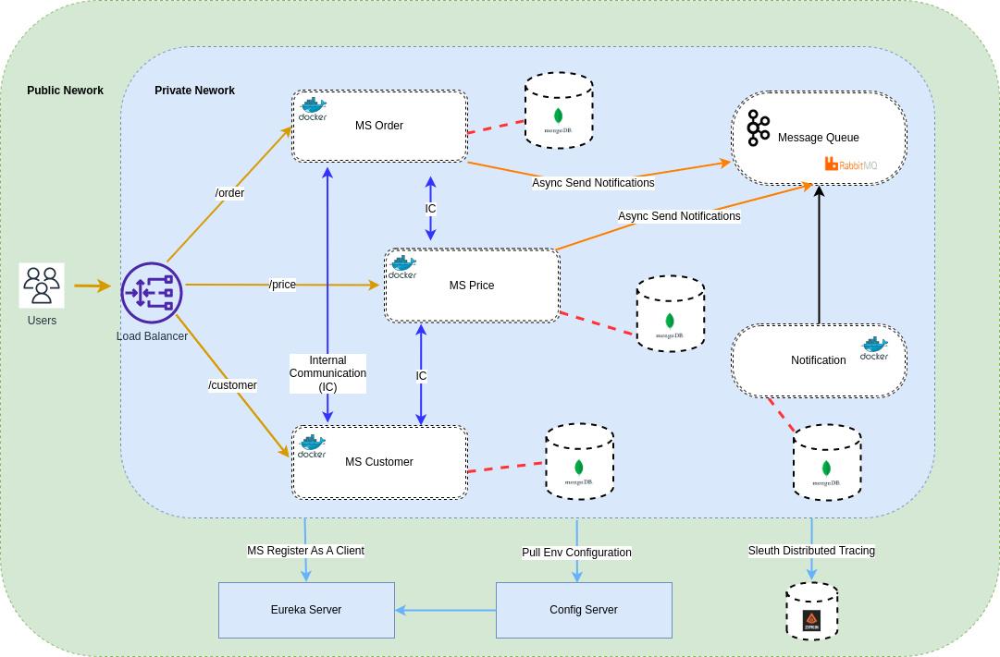

# Car dealership back-end with a Microservices Architecture

This repository shows the development of a dealership back-end using the microservices architecture.
To implement this architecture, used:
* the latest version of Java, Java 11;
* the latest version of Spring Boot, Spring Boot 2.3.5;
* Docker to package the application;
* and Kubernetes to manage the microservices.

### Schema:
